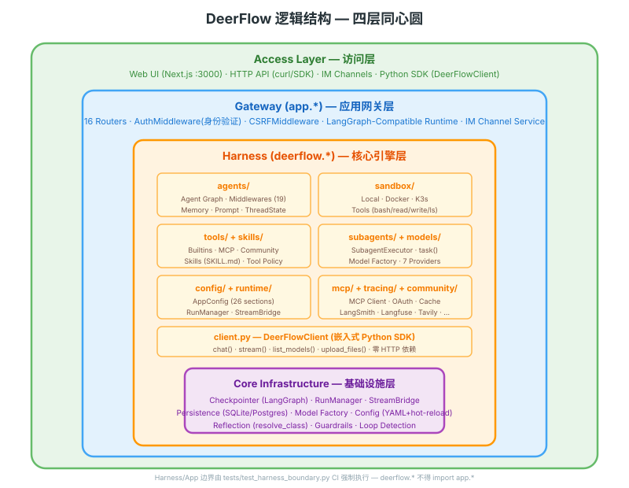
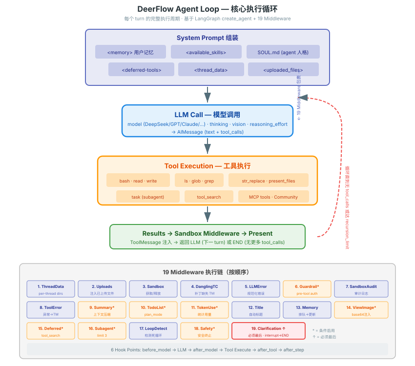
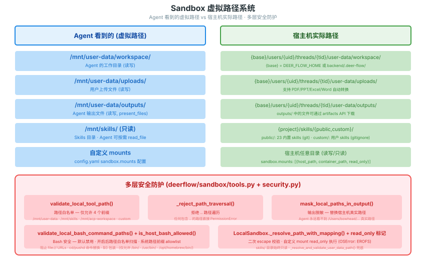

# DeerFlow 逻辑结构图

> 从概念层面展示 DeerFlow 的核心抽象和它们之间的关系。不涉及物理部署，只看"是什么、怎么连"。

---

## 总览：四层同心圆



---

## Agent Loop 核心循环



---

## Middleware Chain（19 个中间件，按执行序）

```
每个 turn 的 LLM 调用和 Tool 执行被以下中间件包裹：

 1. ThreadDataMiddleware      — 创建 per-thread 目录
 2. UploadsMiddleware          — 追踪已上传文件
 3. SandboxMiddleware          — 获取/释放沙箱
 4. DanglingToolCallMiddleware — 补丁缺失的 ToolMessage
 5. LLMErrorHandlingMiddleware — 规范化 LLM 错误
 6. GuardrailMiddleware        — pre-tool-call 鉴权（可选）
 7. SandboxAuditMiddleware     — 安全审计日志
 8. ToolErrorHandlingMiddleware— 工具异常→ToolMessage
 9. SummarizationMiddleware    — 上下文压缩（可选）
10. TodoListMiddleware         — write_todos 任务跟踪（plan_mode）
11. TokenUsageMiddleware       — token 统计（可选）
12. TitleMiddleware            — 自动生成会话标题
13. MemoryMiddleware           — 排队异步更新记忆
14. ViewImageMiddleware        — vision 图片 base64 注入（可选）
15. DeferredToolFilterMdlwr    — MCP 工具延迟发现（可选）
16. SubagentLimitMiddleware    — 限制并行子 agent 数（可选）
17. LoopDetectionMiddleware    — 检测 tool-call 死循环
18. SafetyFinishReasonMdlwr    — 安全终止处理（可选）
19. ClarificationMiddleware    — 拦截 ask_clarification→interrupt（必须最后）

6 个 Hook 点：before_model → LLM → after_model → Tool Execute → after_tool → after_step
```

---

## Skills 加载与选择链


---

## Sub-agent 委派模型


---

## Sandbox 虚拟路径系统



---

## Memory 系统

```
对话消息
    │
    ▼
MemoryMiddleware (过滤: 用户输入 + 最终 AI 回复)
    │
    ▼
MemoryQueue (debounce 30s, per-thread 去重)
    │
    ▼
MemoryUpdater (LLM-based 提取)
    │  提取: workContext, personalContext, topOfMind
    │  提取: facts (preference/knowledge/context/behavior/goal)
    │  去重: whitespace-normalized fact content
    │
    ▼
memory.json (原子写入: temp file + rename)
    │
    ▼
下一 turn 系统 prompt 注入 <memory> 块 (top 15 facts, max 2000 tokens)
```

---

## 关键源码索引

| 概念 | 源码 |
|------|------|
| Agent 创建入口 | `deerflow/agents/lead_agent/agent.py:make_lead_agent()` |
| Agent 循环 | `deerflow/agents/lead_agent/agent.py:_make_lead_agent()` |
| Middleware 组装 | `deerflow/agents/middlewares/tool_error_handling_middleware.py:_build_runtime_middlewares()` |
| Skills 加载 | `deerflow/skills/storage/local_skill_storage.py:load_skills()` |
| 工具组装 | `deerflow/tools/tools.py:get_available_tools()` |
| Sandbox 接口 | `deerflow/sandbox/sandbox.py:Sandbox` |
| Subagent 执行 | `deerflow/subagents/executor.py:SubagentExecutor` |
| Memory 更新 | `deerflow/agents/memory/updater.py` |
| ThreadState | `deerflow/agents/thread_state.py:ThreadState` |
| 系统 prompt | `deerflow/agents/lead_agent/prompt.py:apply_prompt_template()` |
