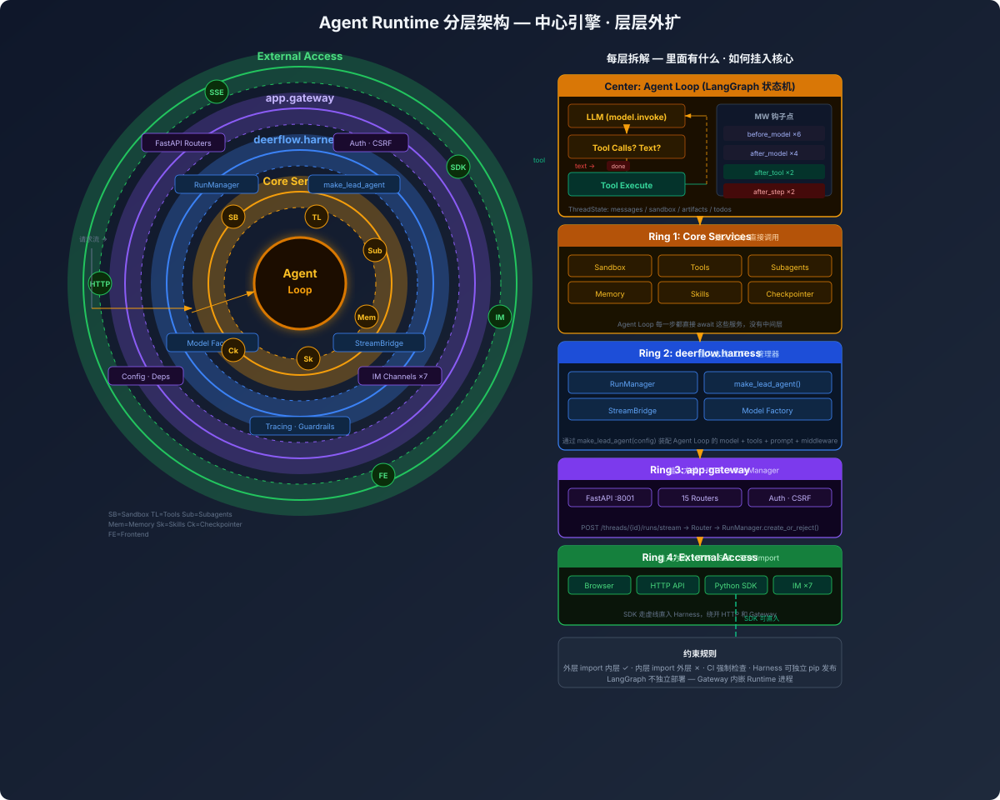
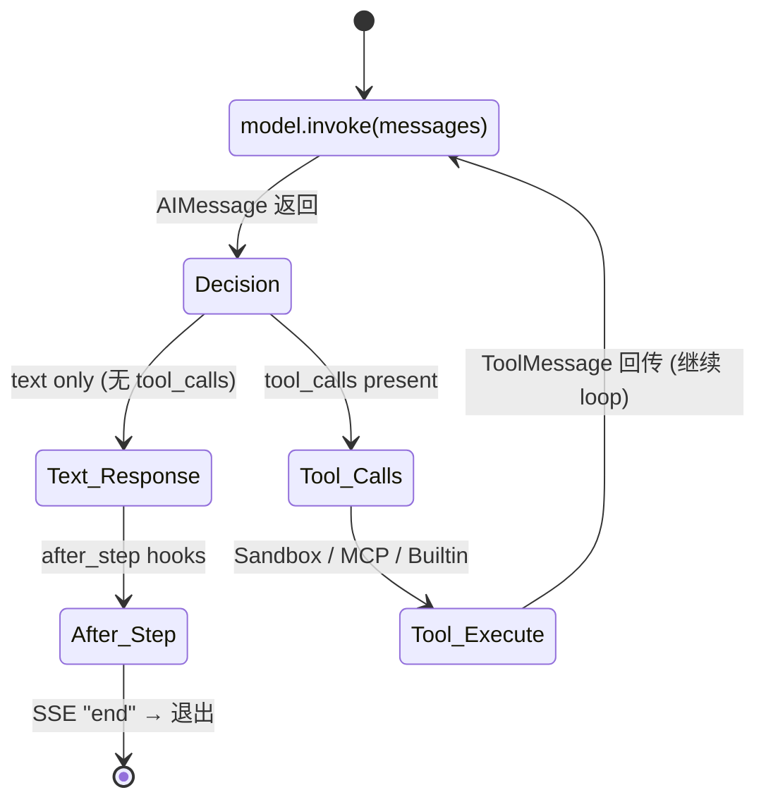

# 系统全景

## 同心圆分层架构



**中心是 Agent Loop（LangGraph 状态机），一层层往外扩。** 外层可以 import 内层，内层不能 import 外层。SDK 可跳过 Gateway 直接入 Harness。

---

## 逐层拆解

### Center: Agent Loop（引擎核心）

Agent Loop 是 LangGraph 构建的状态机。每轮 step 做一件事：**调 LLM → 看返回 → 有 tool_calls 就执行工具再 loop，没有就退出。**



**退出条件只有一个：LLM 返回的 AIMessage 里没有 `tool_calls`，只有文本内容。**

LangGraph 层面，这是一个条件边（conditional edge）——每个 LLM step 结束后检查 `last_message.tool_calls`：
- `tool_calls` 非空 → 路由到 `tools` 节点 → 执行工具 → ToolMessage 追加到 messages → 回到 `agent` 节点（循环）
- `tool_calls` 为空 → 路由到 `END` → after_step middleware → SSE "end" → run 结束

也就是说，Agent Loop 的循环次数完全由 LLM 决定：LLM 认为还需要调工具就继续，LLM 认为可以回答了就退出。没有固定次数上限，但有安全阀——LoopDetectionMiddleware 在连续重复 tool_call >=5 次时强制清除 tool_calls，迫使 LLM 产出文本退出。

**每一步发生的事情：**

| 阶段 | 触发点 | 谁在干活 |
|------|--------|----------|
| 调用 LLM 前 | `before_model` | DynamicContext, Summarization, ViewImage, DeferredTools 等 6 个 MW |
| 调用 LLM | — | `model.invoke(messages)` → AIMessage (text 或 tool_calls) |
| LLM 返回后 | `after_model` | DanglingToolCall, Guardrail, LoopDetection, Clarification 等 4 个 MW |
| 工具执行 | `after_tool` | ToolAuth, ToolResultValidation 2 个 MW |
| Step 结束 | `after_step` | Title, MemoryWrite 2 个 MW |

**ThreadState** 是贯穿全程的状态对象：`messages` (对话历史)、`sandbox` (沙箱实例)、`artifacts` (产物)、`todos` (计划)、`viewed_images` (图片缓存)。

**关键理解：** 这不是一个简单的 while 循环，是 LangGraph 的 StateGraph 节点 + 边。每轮 step，graph 自动从 checkpointer 恢复 ThreadState，经过 middleware 链 → LLM → 条件边（有 tool_calls 则走 tool 节点然后循环，纯文本则走 END）。详见 [05-request-flow.md](05-request-flow.md) 和 [middleware/ section](../internals/middleware/README.md)。

#### 挂入关系

Agent Loop 直接调用 Ring 1 的服务（Sandbox.execute、tool invocation、memory read/write、skill 加载），这些调用发生在 middleware 链的不同阶段。Sandbox 在 SandboxMiddleware 中获取，Tools 在 make_lead_agent 时绑定到 model，Memory 在 after_step 阶段入队。

---

### Ring 1: Core Services（核心基础设施）

Agent Loop 每一步直接依赖的 6 个服务。不涉及 HTTP，纯 Python async 函数调用。


**图上能看到的：**
- 左列：Skills 和 Tools 在图构建时（编译期）装配。虚线 = 编译期绑定，不参与 loop 运行时。
- 中列：Agent Loop 的 4 个 Hook 点（before_agent → LLM → after_model → Tool Execute → after_step）
- 右列：Memory、Subagents、Sandbox 在 Loop 运行时挂入。实线 = 运行时 async hook。
- Checkpointer 不在 loop 内部 — 它是 `agent.checkpointer = checkpointer` 直接属性赋值，LangGraph 在 astream 时透明使用。

六个服务的具体挂入位置：

| 服务 | Hook 点 | 触发机制 | async? | 详见 |
|------|---------|----------|--------|------|
| **Skills** | Graph Construction | `get_skills_prompt_section()` → system prompt 注入 | 否（编译期） | [concepts/skills-tools/skill-md-and-tool-assembly.md](../concepts/skills-tools/skill-md-and-tool-assembly.md) |
| **Tools** | Graph Construction + Tool Execute | `get_available_tools()` → `create_agent(tools=...)` 绑定 | 编译期同步，运行时 `awrap_tool_call` | [concepts/skills-tools/skill-md-and-tool-assembly.md](../concepts/skills-tools/skill-md-and-tool-assembly.md) |
| **Memory** | before_agent + after_agent | DynamicContextMiddleware 注入 + MemoryMiddleware 入队 | `abefore_agent` (async) | [concepts/memory/extract-queue-persist-pipeline.md](../concepts/memory/extract-queue-persist-pipeline.md) |
| **Subagents** | after_model + Tool Execute | SubagentLimitMiddleware 截断 + `task_tool()` 异步协程 | `aafter_model` + async coroutine | [concepts/subagent/dual-threadpool-and-lifecycle.md](../concepts/subagent/dual-threadpool-and-lifecycle.md) |
| **Sandbox** | Tool Execute (lazy init) | `ensure_sandbox_initialized(runtime)` 包裹每个 sandbox tool | `ensure_sandbox_initialized_async` = `asyncio.to_thread` | [concepts/sandbox/abstract-interface-and-three-impls.md](../concepts/sandbox/abstract-interface-and-three-impls.md) |
| **Checkpointer** | 非 middleware | `agent.checkpointer = checkpointer` 直接属性赋值 | LangGraph 内部使用 | [internals/persistence/db-checkpointer-store-backends.md](../internals/persistence/db-checkpointer-store-backends.md) |

#### 挂入关系

六种服务的挂入分两类：

**编译期**（Skills、Tools 的 first hook）— 在 `make_lead_agent()` 中完成，不参与 loop 运行时。Skills 在 system prompt 中注入 `<available_skills>`，Tools 通过 `create_agent(tools=[...])` 绑到 model。

**运行时 async**（Sandbox、Subagents、Memory、Tools 的 second hook）— 通过 middleware 在 Loop 的特定 Hook 点触发，全部是 async。例如 Tool Execute 阶段：`ensure_sandbox_initialized(runtime)` → `await provider.acquire(thread_id)`，task_tool → `await asyncio.sleep(5)` 轮询子 agent 结果。

---

### Ring 2: deerflow.harness（可发布 pip 包）

装配 + 管理 Agent Loop 的框架层。不 `import app.*`，CI 强制检查。

| 组件 | 作用 | 挂入核心的方式 |
|------|------|---------------|
| **RunManager** | `create_or_reject()` 创建 RunRecord，`cancel()` 取消，`set_status()` 更新 | 通过 `asyncio.Task(run_agent)` 启动 Agent Loop |
| **make_lead_agent()** | 7 步工厂：解析 config → 创建 model → 装配 tools → 生成 system prompt → 构建 middleware → create_agent() → 返回 CompiledStateGraph | **直接创建** Agent Loop 的 StateGraph |
| **StreamBridge** | Agent Loop 产出的 chunk → 转发到 SSE/Memory queue | 挂入 graph.astream() 的 for loop |
| **Model Factory** | 通过 reflection 加载 ChatModel（8+ providers），应用 thinking 覆盖 | `create_chat_model()` → 传给 `make_lead_agent` |

#### 挂入关系

`make_lead_agent(config)` 是整个系统的装配点：
1. 从 config.yaml 解析 model_name、tool_groups、subagent 开关等
2. 调用 `create_chat_model()` 创建 LLM 实例
3. 调用 `get_available_tools()` 装配 tool 列表（config + MCP + builtins + ACP agents）
4. 调用 `apply_prompt_template()` 生成 system prompt（注入 skills、memory、日期、subagent 指令）
5. 调用 `_build_middlewares()` 构建 29 个 middleware
6. 调用 `create_agent(model, tools, middleware, state_schema, checkpointer)` 返回 CompiledStateGraph

**`make_lead_agent` 是唯一对外暴露的 graph factory**，在 `langgraph.json` 中注册为 `"lead_agent"`。

---

### Ring 3: app.gateway（HTTP/IM 层，不发布）

| 组件 | 作用 | 挂入 Ring 2 的方式 |
|------|------|-------------------|
| **FastAPI** | HTTP 服务 :8001，~20 个 Routers | `POST /threads/{id}/runs/stream` → `RunManager.create_or_reject()` |
| **Auth** | JWT/OAuth/CSRF/Internal Auth | FastAPI Deps() 注入 → thread_runs 路由获取 user_id |
| **IM Channels** | 7 个平台的消息接收/发送 | 平台 webhook → message_bus → langgraph-sdk → Gateway API |

#### 挂入关系

Gateway 通过 **HTTP 路由 → RunManager** 挂入 Harness。请求到达后：

```
POST /api/threads/{id}/runs/stream
  → thread_runs.py Router (FastAPI Deps 注入 config, auth, user)
  → RunManager.create_or_reject(thread_id, assistant_id)
  → asyncio.Task(run_agent) 在后台启动 Agent Loop
  → 返回 SSE StreamingResponse (立即返回，不等待 run 结束)
```

`langgraph.json` 中的 `auth.path` 指向 Gateway 的 `langgraph_auth.py:auth`，这意味着 LangGraph 兼容的客户端（如 `@langchain/langgraph-sdk`）可直接用 Gateway 的用户体系认证。

---

### Ring 4: External Access（接入方式）

| 接入方式 | 如何进入系统 | 走哪条路径 |
|----------|------------|-----------|
| **Browser/SSE** | `@langchain/langgraph-sdk` SSE 流式 | FE → Nginx → Gateway → Runtime |
| **HTTP API** | REST + SSE，任何语言 | HTTP Client → Gateway → Runtime |
| **Python SDK** | `from deerflow.client import DeerFlowClient` | **直接 import Harness，不走 HTTP** |
| **IM ×7** | 飞书/Slack/Telegram 等 webhook | IM Platform → Gateway → Runtime |

#### 关键：SDK 短路路径

Python SDK (`DeerFlowClient`) 绕过 Ring 3，直接 import `deerflow.harness`：

```
Browser:     FE → Nginx → Gateway → RunManager → Agent Loop
HTTP API:    Client → Gateway → RunManager → Agent Loop
SDK:         DeerFlowClient.chat() ────→ Agent Loop (同进程，无网络)
IM:          IM webhook → Gateway → RunManager → Agent Loop
```

SDK 的优势：零网络开销、无序列化、不需要启动 Gateway 进程。详见 [getting-started/03-python-sdk.md](../getting-started/03-python-sdk.md)。

---

## 进程拓扑

| 进程 | 端口 | 技术 | 角色 |
|------|------|------|------|
| **Nginx** | 2026 | nginx:alpine | 反向代理、统一入口、路由分发 |
| **Frontend** | 3000 | Next.js 16 + React 19 | Web UI |
| **Gateway** | 8001 | FastAPI + Uvicorn | REST API + Agent Runtime（嵌入 LangGraph） |
| **Provisioner** | 8002 | Python | K3s 沙箱管理（可选） |

Gateway 是核心进程 — 不依赖独立 LangGraph Server，Runtime 内嵌在 Gateway 进程里。

## langgraph.json — Agent 注册中心

```json
{
  "graphs": {
    "lead_agent": "deerflow.agents:make_lead_agent"
  },
  "auth": {
    "path": "./app/gateway/langgraph_auth.py:auth"
  },
  "checkpointer": {
    "path": "./packages/harness/deerflow/runtime/checkpointer/async_provider.py:make_checkpointer"
  }
}
```

三件事：**graph 注册**（唯一图 `lead_agent`）、**auth**（复用 Gateway 用户体系）、**checkpointer**（memory/sqlite/postgres）。

## 目录结构映射

```
deer-flow/
├── config.yaml
├── extensions_config.json
├── skills/{public,custom}/
├── backend/
│   ├── langgraph.json
│   ├── packages/harness/deerflow/   ← Ring 1 + Ring 2
│   │   ├── agents/       Lead agent + middlewares
│   │   ├── runtime/      RunManager + checkpointer + stream bridge
│   │   ├── sandbox/      沙箱抽象 + local 实现
│   │   ├── subagents/    子 Agent 系统
│   │   ├── tools/        工具装配 + builtins
│   │   ├── models/       模型工厂
│   │   ├── mcp/          MCP 集成
│   │   ├── skills/       Skill 加载
│   │   ├── config/       配置系统 (29 文件)
│   │   ├── community/    Tavily/Jina/DDG/AioSandbox
│   │   ├── persistence/  ORM + DB 引擎
│   │   ├── guardrails/   工具鉴权
│   │   ├── tracing/      LangSmith + Langfuse
│   │   └── client.py     DeerFlowClient (SDK 入口)
│   └── app/              ← Ring 3
│       ├── gateway/      FastAPI + 15 routers + auth
│       └── channels/     7 个 IM 平台
└── frontend/             ← Ring 4 (Browser/SSE)
    └── src/              Next.js + React 19 + Tailwind
```

## 技术栈

| 层 | 关键依赖 |
|----|----------|
| Agent 框架 | LangGraph >= 1.1.9, LangChain >= 1.2.15 |
| 模型 Provider | langchain-openai, langchain-anthropic, langchain-deepseek, langchain-google-genai |
| 沙箱 | agent-sandbox >= 0.0.19（AIO）, agent-client-protocol >= 0.4.0（ACP） |
| MCP | langchain-mcp-adapters >= 0.2.2 |
| 持久化 | SQLAlchemy 2.0 async, aiosqlite, alembic, duckdb |
| 可观测 | langfuse >= 3.4.1, LangSmith |
| API | FastAPI, uvicorn, sse-starlette |
| IM | lark-oapi, slack-sdk, python-telegram-bot, dingtalk-stream |
| 前端 | Next.js 16, React 19, Tailwind CSS 4, pnpm |
