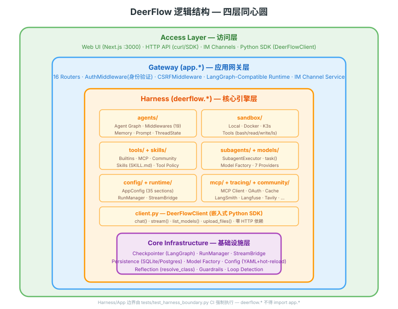
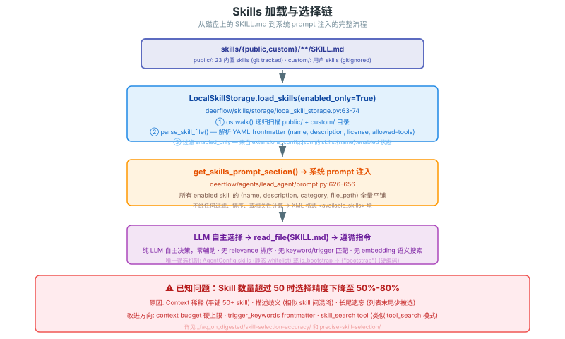
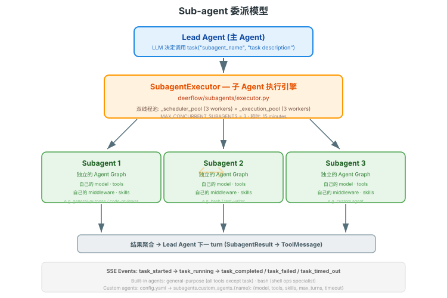

# DeerFlow 逻辑结构图

> 从概念层面展示 DeerFlow 的核心抽象和它们之间的关系。不涉及物理部署，只看"是什么、怎么连"。

---

## 总览：四层同心圆



---

## Agent Loop 核心循环


---

## Middleware Chain（29 个中间件，按执行序）

完整目录见 [internals/middleware/03-catalog.md](../internals/middleware/03-catalog.md)。

6 个 Hook 点：before_model → LLM → after_model → Tool Execute → after_tool → after_step

---

## Skills 加载与选择链



---

## Sub-agent 委派模型



---

## Sandbox 虚拟路径系统


---

## Memory 系统

```
对话消息
    │
    ▼
MemoryMiddleware (过滤: 用户输入 + 最终 AI 回复)
    │
    ▼
MemoryQueue (debounce 30s, per-thread 去重)
    │
    ▼
MemoryUpdater (LLM-based 提取)
    │  提取: workContext, personalContext, topOfMind
    │  提取: facts (preference/knowledge/context/behavior/goal)
    │  去重: whitespace-normalized fact content
    │
    ▼
memory.json (原子写入: temp file + rename)
    │
    ▼
下一 turn 系统 prompt 注入 <memory> 块 (top 15 facts, max 2000 tokens)
```

---

## 关键源码索引

| 概念 | 源码 |
|------|------|
| Agent 创建入口 | `deerflow/agents/lead_agent/agent.py:make_lead_agent()` |
| Agent 循环 | `deerflow/agents/lead_agent/agent.py:_make_lead_agent()` |
| Middleware 组装 | `deerflow/agents/middlewares/tool_error_handling_middleware.py:_build_runtime_middlewares()` |
| Skills 加载 | `deerflow/skills/storage/local_skill_storage.py:load_skills()` |
| 工具组装 | `deerflow/tools/tools.py:get_available_tools()` |
| Sandbox 接口 | `deerflow/sandbox/sandbox.py:Sandbox` |
| Subagent 执行 | `deerflow/subagents/executor.py:SubagentExecutor` |
| Memory 更新 | `deerflow/agents/memory/updater.py` |
| ThreadState | `deerflow/agents/thread_state.py:ThreadState` |
| 系统 prompt | `deerflow/agents/lead_agent/prompt.py:apply_prompt_template()` |
