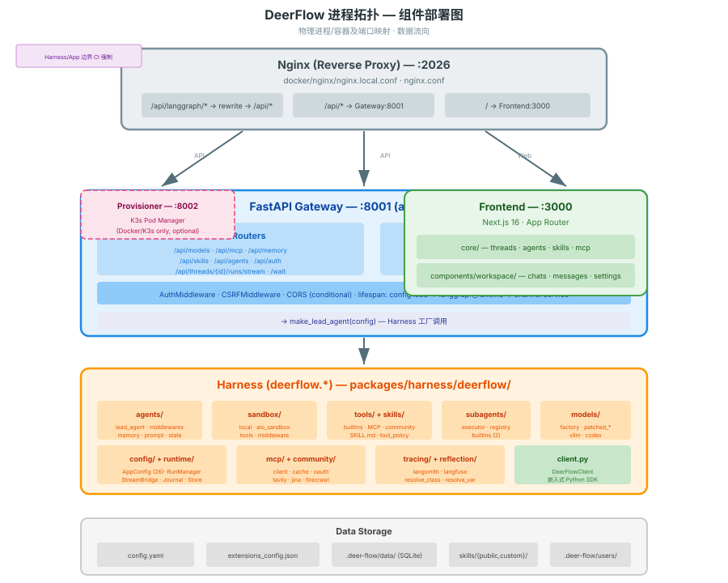
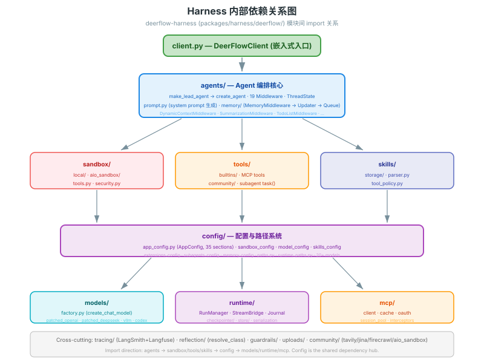

# DeerFlow 组件结构图

> 展示所有物理组件（进程/服务/模块）及其连接关系。每个框对应一个真实的代码模块或运行中进程。

---

## 进程拓扑



> 关键端口：Nginx :2026（统一入口）→ Gateway :8001（API+Runtime）/ Frontend :3000（Next.js）/ Provisioner :8002（K3s optional）。详细内部模块见上图。

---

## Harness/App 边界（CI 强制执行）

`app.*` 可以 import `deerflow.*`，`deerflow.*` 不得 import `app.*`。由 `tests/test_harness_boundary.py` CI 强制执行。

---

## 依赖关系图（deerflow-harness 内部）



---

## 数据存储（Persistence）

```
config.yaml                              .deer-flow/
├── models: [...]                        ├── data/
├── sandbox: {...}                       │   └── deerflow.db (SQLite)
├── tools: [...]                         │       ├── run_store
├── subagents: {...}                     │       ├── thread_meta
├── memory: {...}                        │       ├── feedback
├── summarization: {...}                 │       └── run_events
├── title: {...}                         │
├── guardrails: {...}                    ├── users/{uid}/
├── tool_search: {...}                   │   ├── memory.json
├── loop_detection: {...}                │   ├── agents/{name}/
├── ... (26 sections)                    │   │   ├── SOUL.md
└── ...                                  │   │   └── config.yaml
                                         │   └── threads/{tid}/
extensions_config.json                   │       └── user-data/
├── mcpServers: {...}                    │           ├── workspace/
│   ├── github: {enabled, ...}           │           ├── uploads/
│   └── filesystem: {enabled, ...}       │           └── outputs/
└── skills: {...}                        │
    ├── bootstrap: {enabled: true}       skills/
    └── my-skill: {enabled: true}        ├── public/  (23 built-in skills)
                                         └── custom/  (user skills, gitignored)
```

---

## IM Channels 连接架构

```
Feishu · Slack · Telegram · DingTalk
        │
        ▼
┌─────────────────────────────────┐
│    app/channels/                │
│  ┌───────────────────────────┐  │
│  │     ChannelManager        │  │
│  │  message_bus.py (pub/sub) │  │
│  │  store.py (thread 映射)    │  │
│  └───────────┬───────────────┘  │
│              │                   │
│  ┌───────────▼───────────────┐  │
│  │  Platform Implementations │  │
│  │  feishu.py · slack.py     │  │
│  │  telegram.py · dingtalk.py│  │
│  └───────────────────────────┘  │
└─────────────┬───────────────────┘
              │ langgraph-sdk HTTP client
              ▼
┌─────────────────────────────────┐
│    Gateway (internal auth)      │
│  /api/threads/*/runs            │
└─────────────────────────────────┘
```

---

## 关键源码索引

| 组件 | 源码路径 |
|------|---------|
| Gateway 入口 | `backend/app/gateway/app.py:create_app()` |
| Harness 包 | `backend/packages/harness/deerflow/` |
| LangGraph 图注册 | `backend/langgraph.json` |
| Makefile 入口 | `Makefile` · `scripts/serve.sh` |
| Docker Compose | `docker/docker-compose-dev.yaml` |
| Nginx 路由 | `docker/nginx/nginx.local.conf` · `nginx.conf` |
| 前端核心逻辑 | `frontend/src/core/` |
| 前端组件 | `frontend/src/components/workspace/` |
| 边界测试 | `backend/tests/test_harness_boundary.py` |
