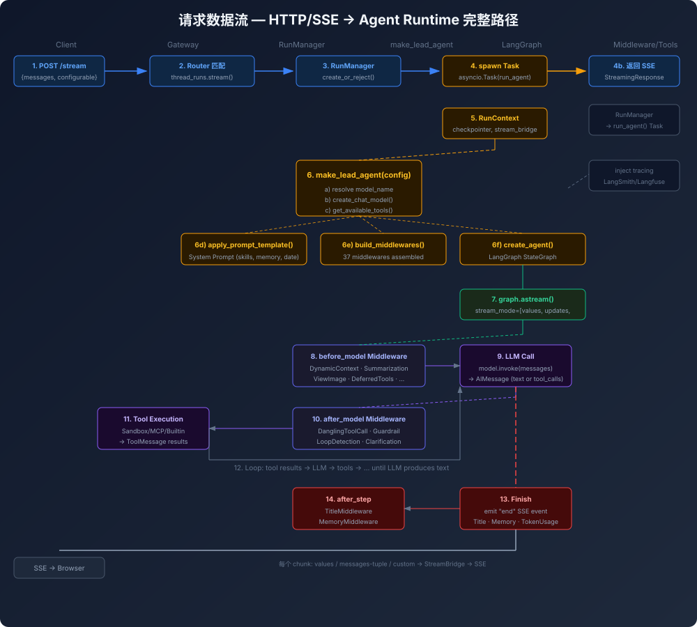
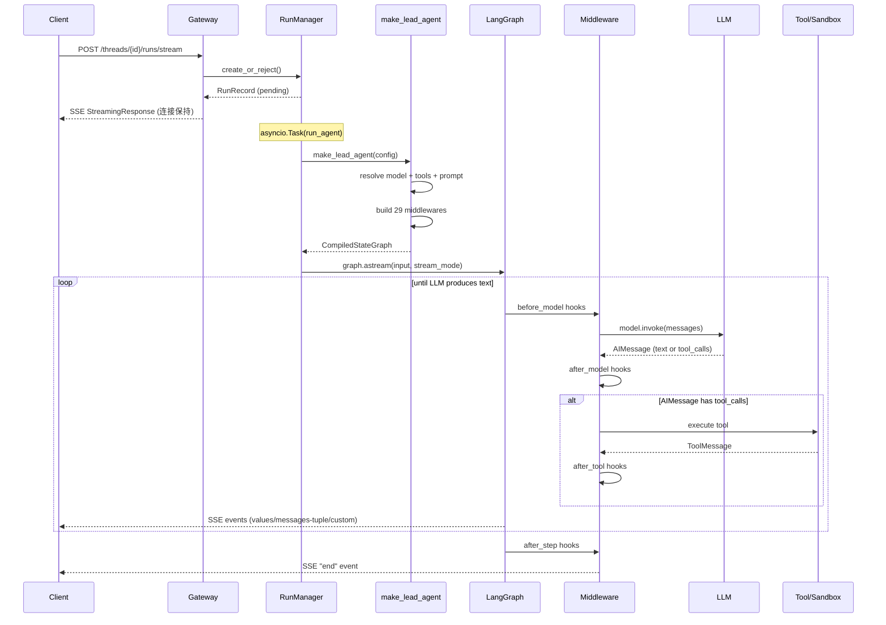

# 请求数据流

一次完整的对话请求如何流经系统。以 `POST /api/threads/{id}/runs/stream` 为例。



## 时序图



## 完整链路（13 步）

```
 1. Browser                          POST /api/threads/{id}/runs/stream
        │
 2. Nginx (:2026)                    路由 /api/* → Gateway :8001
        │
 3. Gateway Router                   路径匹配 → thread_runs.py
        │                           FastAPI dependency injection
        │                           (config, auth, client singletons)
        │
 4. RunManager.create_or_reject()   创建 RunRecord (pending)
        │                           multitask_strategy: "interrupt"|"rollback"
        │
 5. asyncio.Task  spawning          run_agent() 被调度为后台 Task
        │                           返回 SSE StreamingResponse 给客户端
        │
        │   ┌─── run_agent() 开始 ───────────────────────┐
        │   │                                             │
 6.     │   RunContext 构建                               │
        │   - checkpointer (get from context manager)     │
        │   - store (LangGraph BaseStore)                 │
        │   - stream_bridge (SSE ↔ memory bridge)         │
        │   - run_id, thread_id, assistant_id             │
        │                                             │
 7.     │   config 注入                                  │
        │   - tracing callbacks                          │
        │   - langfuse metadata (session/user/tags)      │
        │   - run_metadata (run_id, thread_id, started_at)│
        │                                             │
 8.     │   make_lead_agent(config) ─────────────────┐   │
        │   │                                          │   │
        │   │  a) 解析 runtime_config                  │   │
        │   │     - model_name, thinking_enabled       │   │
        │   │     - is_plan_mode, subagent_enabled     │   │
        │   │     - is_bootstrap, agent_name           │   │
        │   │                                          │   │
        │   │  b) create_chat_model(model_name,         │   │
        │   │       thinking_enabled)                   │   │
        │   │     - 通过 reflection 加载 ChatModel      │   │
        │   │     - 应用 when_thinking_enabled 覆盖     │   │
        │   │                                          │   │
        │   │  c) get_available_tools()                 │   │
        │   │     - config-defined tools (web_search ..)│   │
        │   │     - MCP tools (if enabled)              │   │
        │   │     - builtins (task, view_image, ...)    │   │
        │   │     - ACP agents                          │   │
        │   │     - 按名称去重，config 优先              │   │
        │   │                                          │   │
        │   │  d) apply_prompt_template()               │   │
        │   │     - 生成 system prompt                  │   │
        │   │     - 注入 date, memory, skills,          │   │
        │   │       subagent 指令                       │   │
        │   │                                          │   │
        │   │  e) _build_middlewares()                  │   │
        │   │     - 8 runtime middlewares               │   │
        │   │     - DynamicContext, Summarization,      │   │
        │   │       TodoList, TokenUsage, Title,        │   │
        │   │       Memory, ViewImage, DeferredTools,   │   │
        │   │       SubagentLimit, LoopDetection,       │   │
        │   │       SafetyFinishReason, Clarification   │   │
        │   │                                          │   │
        │   │  f) create_agent(                         │   │
        │   │       model, tools,                       │   │
        │   │       middleware=middlewares,             │   │
        │   │       state_schema=ThreadState,           │   │
        │   │       checkpointer=...                    │   │
        │   │     )                                     │   │
        │   │     - LangChain 创建 StateGraph          │   │
        │   │     - 绑定 tools + middleware             │   │
        │   │     - 返回 CompiledStateGraph             │   │
        │   └──────────────────────────────────────────┘   │
        │                                             │
 9.     │   graph.astream(                             │
        │     input={"messages": [...]},              │
        │     stream_mode=["values", "updates",        │
        │                  "messages", "custom"]        │
        │   )                                          │
        │                                             │
10.     │   for chunk in astream():                   │
        │     │  每个 chunk 经过 serialization         │
        │     │  → StreamBridge → SSE to client        │
        │     │                                        │
        │     │  事件类型:                              │
        │     │  - values: ThreadState 快照             │
        │     │  - messages-tuple: 增量消息              │
        │     │  - custom: 自定义事件 (如 task_started)  │
        │     │                                        │
        │   └────────────────────────────────────────┘   │
        │                                             │
11.     │   graph 执行中:                              │
        │   - LLM 接收 system prompt + history +       │
        │     new user message                        │
        │   - LLM 决定 tool call 或 text response      │
        │   - 如有 tool call → Middleware 鉴权         │
        │     → Sandbox/MCP 执行 → 结果回传 LLM        │
        │   - 循环直到 LLM 输出文本回复                 │
        │                                             │
12.     │   结束:                                      │
        │   - emit "end" event                        │
        │   - RunManager 标记 RunRecord 为 finished     │
        │   - TitleMiddleware 生成标题                  │
        │   - MemoryMiddleware 入队记忆更新             │
        │   - TokenUsageMiddleware 记录用量             │
        │                                             │
        └─────────────────────────────────────────────┘
        │
13. Client                          收到完整的 SSE 事件流
                                    渲染消息到 UI
```

## Middleware 触发点

在 graph 的每个 step 中，middleware 按以下时机触发：

```
             ┌──────────────────┐
             │   before_model   │  ← DynamicContext, Summarization,
             │   (调用 LLM 前)   │     ViewImage, DeferredTools,
             └────────┬─────────┘     SubagentLimit, SafetyFinishReason
                      │
                      ▼
             ┌──────────────────┐
             │    LLM Call      │
             └────────┬─────────┘
                      │
                      ▼
             ┌──────────────────┐
             │   after_model    │  ← DanglingToolCall, Guardrail,
             │   (LLM 返回后)    │     SandboxAudit, ToolErrorHandling,
             └────────┬─────────┘     LoopDetection, SafetyFinish,
                      │               Clarification (最后一个)
                      ▼
             ┌──────────────────┐
             │   Tool Execute   │  ← Sandbox/MCP/Builtin 工具
             └────────┬─────────┘
                      │
                      ▼
             ┌──────────────────┐
             │   after_tool     │  ← TokenUsage
             └────────┬─────────┘
                      │
                      ▼
             ┌──────────────────┐
             │   after_step     │  ← Title, Memory
             └──────────────────┘
```

## RunManager 与 RunStore

```
RunManager
├── create_or_reject(thread_id, assistant_id, multitask_strategy)
├── get(run_id) → RunRecord
├── cancel(run_id) → 设置取消标志
├── set_status(run_id, status) → updating
├── list_by_thread(thread_id) → [RunRecord]
└── 通过 RunStore 持久化到 db/jsonl/memory

RunRecord
├── run_id, thread_id, assistant_id
├── status (pending/running/completed/failed/cancelled)
├── created_at, updated_at
├── task (asyncio.Task handle)
└── control state (cancel_event, stream_bridge)
```

## StreamBridge 的两种模式

Gateway 和 Client 使用不同的 bridge：

| 模式 | 使用场景 | 实现 |
|------|----------|------|
| **SSE Bridge** | Gateway HTTP | `sse-starlette` EventSourceResponse |
| **Memory Bridge** | DeerFlowClient | 同步 queue，调用方轮询 |

两种 bridge 的接口一致：`write_event(event_type, data)` → 消费方收到相同格式的事件。

## 无状态 Run (`POST /api/runs/stream`)

相比 Thread Run，跳过了：
- Thread 持久化（不创建 thread）
- Checkpointer（无状态）
- 部分 middleware（如 Memory、Title 不需要）

用于简单的一次性查询，不需要上下文保留。
