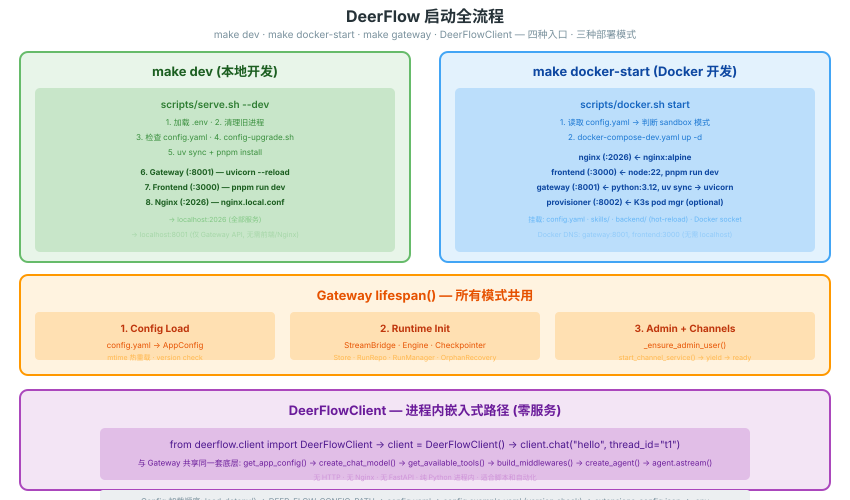
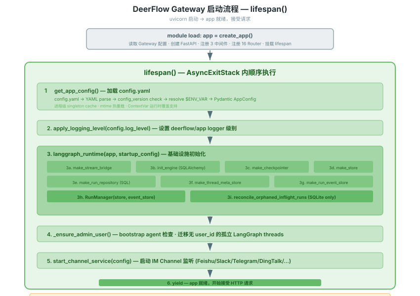
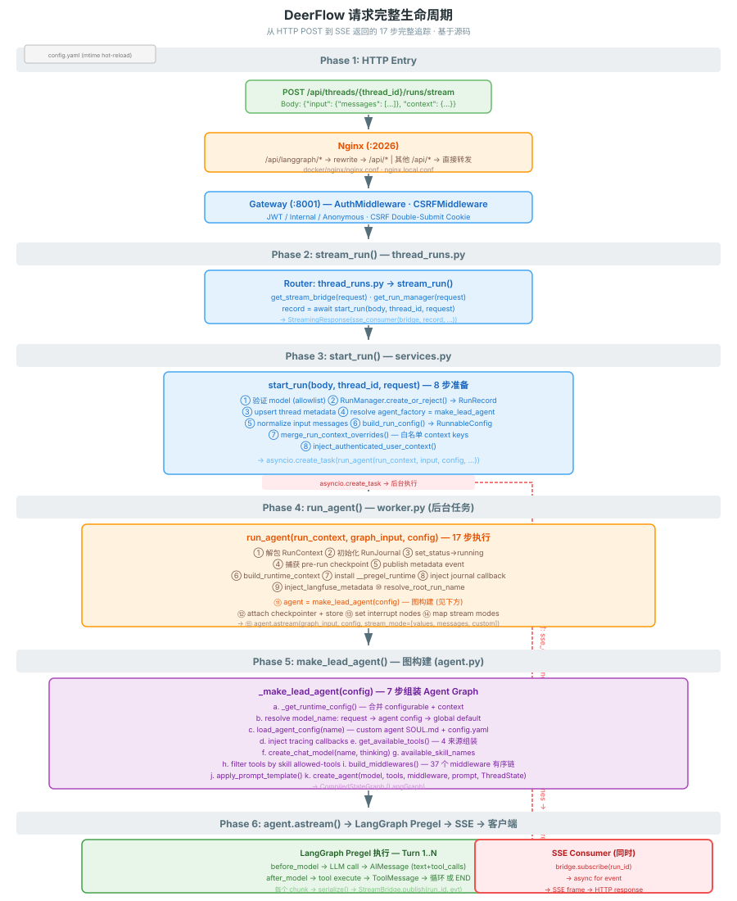

# DeerFlow 启动与请求处理全流程

> 从敲命令到 agent 返回第一个 token 的完整时序。基于源码追踪，非推测。

---

## 启动入口总览



四种启动入口在同一张图中对比：`make dev`（本地）· `make docker-start`（Docker）· `make gateway`（后端 only）· `DeerFlowClient`（进程内）。所有模式共享 `lifespan()` 和 `_make_lead_agent()`。

---

## Gateway 进程初始化（lifespan）



从 uvicorn 启动到 app 就绪的 6 步：`create_app()` → `get_app_config()` → `langgraph_runtime()`（StreamBridge/Checkpointer/RunManager…共 9 个子步骤）→ `_ensure_admin_user()` → `start_channel_service()` → `yield`。

---

## 一个请求的完整生命周期



17 步完整追踪，分 6 个 Phase：

| Phase | 文件 | 做什么 |
|-------|------|--------|
| 1. HTTP Entry | Nginx + Gateway | 路由、Auth、CSRF |
| 2. stream_run | `thread_runs.py` | 获取 bridge/run_mgr，调用 start_run |
| 3. start_run | `services.py` | 8 步准备（model 验证 → RunRecord → build_run_config → context override） |
| 4. run_agent | `worker.py` | 17 步执行（journal → checkpoint → agent factory → astream → finally） |
| 5. make_lead_agent | `agent.py` | 7 步装配 Agent Graph（config → model → tools → middlewares → prompt → create_agent） |
| 6. Pregel + SSE | LangGraph + StreamBridge | Turn 1..N 循环 → serialize → Bridge.publish → SSE frames |

---

## 关键启动配置加载顺序

```
1. load_dotenv()           ← app_config.py 模块导入时自动执行
2. DEER_FLOW_CONFIG_PATH   ← env var 优先级最高
3. config.yaml             ← 项目根目录（推荐）
4. config.example.yaml     ← config_version 比对
5. extensions_config.json  ← MCP servers + skills enabled 状态
6. .env                    ← API keys ($OPENAI_API_KEY 等)
```

---

## 关键源码索引

| 步骤 | 源码 |
|------|------|
| serve.sh 启动脚本 | `scripts/serve.sh` |
| Docker 启动脚本 | `scripts/docker.sh` |
| Gateway create_app | `backend/app/gateway/app.py:create_app()` |
| Gateway lifespan | `backend/app/gateway/app.py:lifespan()` |
| langgraph_runtime | `backend/app/gateway/langgraph_runtime.py` |
| stream_run handler | `backend/app/gateway/routers/thread_runs.py:stream_run()` |
| start_run | `backend/app/gateway/services.py:start_run()` |
| build_run_config | `backend/app/gateway/services.py:build_run_config()` |
| merge_run_context_overrides | `backend/app/gateway/services.py:merge_run_context_overrides()` |
| run_agent | `deerflow/runtime/runs/worker.py:run_agent()` |
| make_lead_agent | `deerflow/agents/lead_agent/agent.py:make_lead_agent()` |
| _make_lead_agent | `deerflow/agents/lead_agent/agent.py:_make_lead_agent()` |
| get_available_tools | `deerflow/tools/tools.py:get_available_tools()` |
| create_chat_model | `deerflow/models/factory.py:create_chat_model()` |
| _build_middlewares | `deerflow/agents/lead_agent/agent.py:_build_middlewares()` |
| apply_prompt_template | `deerflow/agents/lead_agent/prompt.py:apply_prompt_template()` |
| sse_consumer | `backend/app/gateway/routers/thread_runs.py:sse_consumer()` |
| Config 加载 | `deerflow/config/app_config.py:AppConfig.from_file()` |
| 热重载机制 | `deerflow/config/app_config.py:get_app_config()` |
| DeerFlowClient | `deerflow/client.py:DeerFlowClient` |
